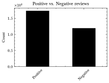

<!--
header: Eksploracja tekstu i danych online
footer: 27.01.2025 r.
-->

# 🏨 😊💬 😡💬 📊
# Badanie sentymentu w recenzjach hoteli

Dawid Karpiński

---

### Dane z **Booking.com**

**Title**, **Positive Review**, **Negative Review**, **Score**, Guest Name, Guest Country, Room Type, Number of Nights, Visit Date, Group Type, Property Response

<small style="font-size: 0.6em">https://www.kaggle.com/datasets/michelhatab/hotel-reviews-bookingcom</small>

---

---

---

---

---

---

---

# Dziękuję za uwagę :)
